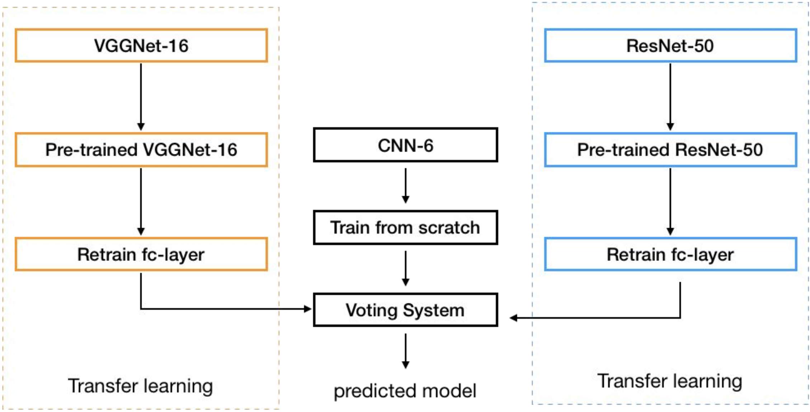
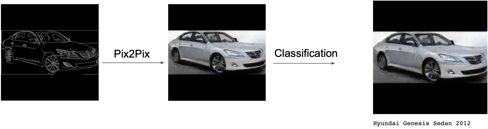
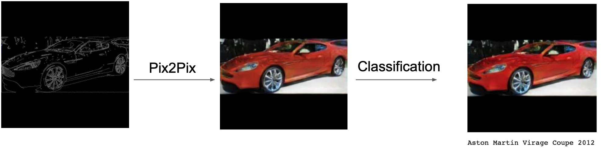

# :oncoming_automobile:CarchMind (Car + Catch Mind):oncoming_automobile:

## Introduction
This project had been proceed in class called 'Open Source Project2' in Konkuk University(South Korea).  

- With our project, users will be able to  

1. Make fake car image with sketch drawing of car. (Using Pix2Pix)  
2. Check which automobile company's model is similar to fake car image based on sketch of users. (Using Transfer Learning)  

## Installation:hammer:
Clone this repository via
```
git clone https://github.com/yyoonsahng/CarchMind.git
```

## Dataset:page_facing_up:
We used ['Stanford Cars Dataset'](https://www.kaggle.com/jessicali9530/stanford-cars-dataset) from Kaggle.  
Download Dataset and locate train and test car images on ```classification/data/cars/test or train```  
Also locate ```anno_test.csv```, ```anno_train.csv```, ```name.csv``` on ```classification/data/cars/```

## Classification:open_file_folder:
### Classification Model Architecture:construction_worker:

We used three training model, two pre-trained model(ResNet, VGG) and cutomized 6-layer CNN. Each model will be trained and produce result independently. 

After train is finished, result of tree model will be given weights and combined into one result. (Sum of weights is 1)  
```python
model1_outputs = model1(inputs) #Indicates result of ResNet50
model2_outputs = model2(inputs) #Indicates result of VGG16
model3_outputs = model3(inputs) #Indicates result of 6-layer CNN
outputs = model1_outputs * 0.3 + model2_outputs * 0.3 + model3_outputs * 0.4 #output is combined result
```

Class that has the highest value in combined result will be shown to user.  

## Training:runner:
Run ```classification/our_proposal_model.ipynb```  
If train is finished, ```newModel.pt``` will be created.

## Result
### Classification Accuracy
Our classification model showed better performance than any other single pre-trained model.
||ResNet18|ResNet50|VGG16|**Our Model**|
|------|---|---|---|---|
|Validation Accuracy|0.6826|0.7604|0.7988|**0.8207**|

### Total Result



## Requirements
- Pytorch  
- Python version above than 3.7  
- CUDA enable device is required for training

## Reference
[Deep Transfer Learning for Modality Classification of Medical Images](https://www.mdpi.com/2078-2489/8/3/91)  
Yuhai Yu, Hongfei Lin, Jiana Meng, Xiaocong Wei, Hai Guo, and Zhehuan Zhao
