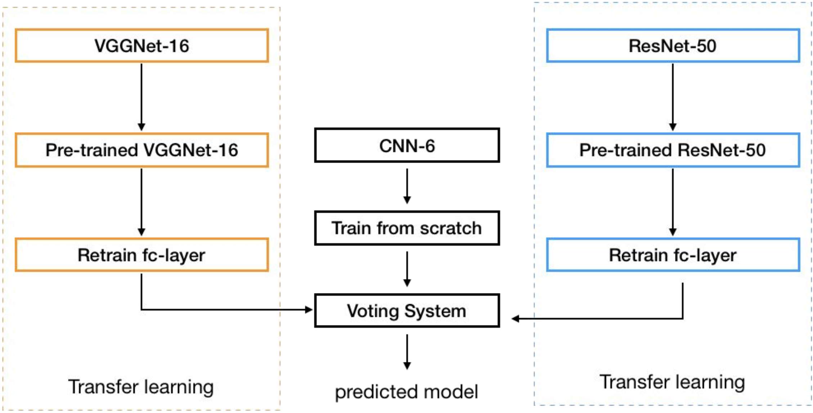

# :oncoming_automobile:CarchMind (Car + Catch Mind):oncoming_automobile:

## Introduction
This project had been proceed in class called 'Open Source Project2' in Konkuk University.

## Installation:hammer:
Clone this repository via
```
git clone https://github.com/yyoonsahng/CarchMind.git
```

## Dataset
We used ['Stanford Cars Dataset'](https://www.kaggle.com/jessicali9530/stanford-cars-dataset) from Kaggle.  
Download Dataset and locate train and test car images on ```classification/data/cars/test or train```  
Also locate ```anno_test.csv```, ```anno_train.csv```, ```name.csv``` on ```classification/data/cars/```

## Classification:open_file_folder:
using GAN and Transfer Learning(ResNet VGG)

## Model Architecture


## Training
Run ```classification/our_proposal_model.ipynb```  
If train is finished, ```newModel.pt``` will be created.

## Requirements
Pytorch
Python version above than 3.7
